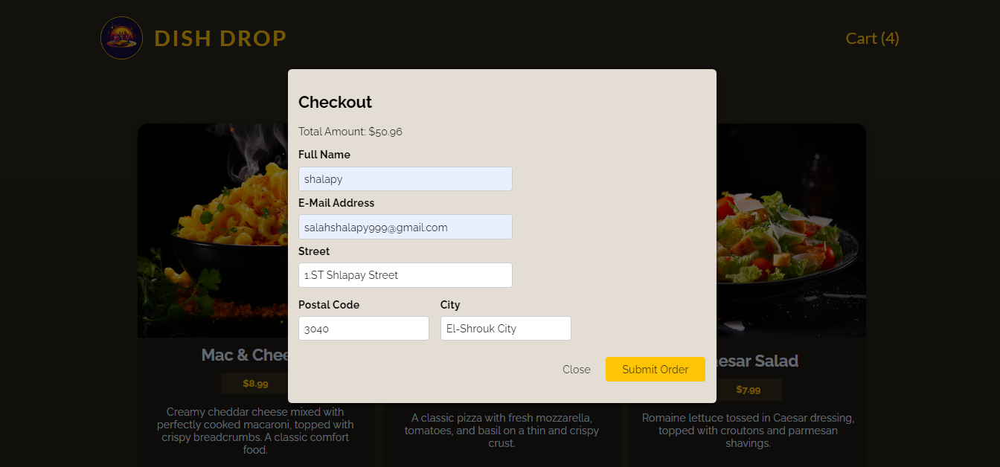

# DishDrop

[](https://react.dev/)


DishDrop is a feature-rich web application for ordering meals online. Built with React.js, the app is optimized for performance, accessibility, and usability. It demonstrates advanced React concepts like Context API, custom hooks, and reusable components.

## Project Overview

### Overview


### Cart Overview


### Checkout Overview



## **Features**

### 1. Meals Listing

- Browse available meals fetched from a backend.
- View meal details including price, description, and image.

### 2. Cart Management

- Add items to the cart with dynamic updates.
- Adjust quantities or remove items as needed.
- View total price dynamically updated with currency formatting.

### 3. Checkout Process

- Fill in delivery and contact details in a responsive form.
- Submit orders securely to the backend.
- Receive success or error feedback instantly.

### 4. Context Management

- Cart state is managed globally using Context API.
- User progress (cart/checkout modals) is tracked for seamless navigation.

### 5. Error Handling

- Clear and actionable error messages for failed data fetches or submissions.

### 6. Reusable Components

- Modular design with reusable components for modal dialogs, buttons, and inputs.

## Usage

1. Navigate throuht meals and create your cart.
2. Increase or Decrease your meals quantity.
3. Close cart or checkout your progress.
4. Fill the check out from and Submit.

## Project Structure

```
DishDrop
│      .gitignore
│      .vite.config
│      index.html
│      package-lock.json
│      package.json
│      README.md
│
│
└───public
│   logo.png
│   overview.png
│   cart.png
│   checkout.png
│
│
└───backend
│   │    app.js
│   │    package-lock.json
│   │    package.json
│   │
│   └─── data
│   │    available-meals.json
│   │    orders.json
│   │
│   └─── public --------> Contains all images sourcs
│
└─── src
    │   App.jsx
    │   main.jsx
    │   index.css
    │
    ├─── assets
    │      logo.png
    │
    ├─── components
    │   │  Header.jsx
    │   │  Error.jsx
    │   │  Checkout.jsx
    │   │
    │   └─── Carts
    │   │    Cart.jsx
    │   │    CartItem.jsx
    │   │
    │   └─── Meals
    │       Meals.jsx
    │       SingleMeal.jsx
    │
    ├─── hooks
    │      useHttp.js
    │
    ├─── store
    │      CartContext.jsx
    │      UserProgressContext.jsx
    │
    ├─── UI
    │      Button.jsx
    │      Input.jsx
    │      Modal.jsx
    │
    ├─── Util
    │    formatting.js
    │
```

## Installation

To get started with the project locally:

1. Clone the repository:
   ```bash
   git clone https://github.com/SalahShallapy/DishDrop.git
   ```
2. Navigate to the project directory:
   ```bash
   cd DishDrop
   ```
3. Navigate to the backend directory:
   ```bash
   cd backend
   ```
4. Install backend dependencies:
   ```bash
   npm install
   ```
5. Run the backend server:
   ```bash
   npm start
   ```
6. Navigate out of the backend directory into the main project's directory:
   ```bash
   cd ..
   ```
7. Install dependencies:
   ```bash
   npm install
   ```
8. Run the project:
   ```bash
   npm run dev
   ```

## Note

- This project's backend is locally setup and isn'ts running on a server so you have to follow the installing steps and start the backend server in order to see the fetched data on the frontend UI

## Contributing

Contributions are what make the open source community such an amazing place to learn, inspire, and create. Any contributions you make are **greatly appreciated**.

If you have a suggestion that would make this better, please fork the repo and create a pull request. You can also simply open an issue with the tag "enhancement".
Don't forget to give the project a star! Thanks!

1.  Fork the Project
2.  Create your Feature Branch (`git checkout -b feature/AmazingFeature`)
3.  Commit your Changes (`git commit -m 'Add some AmazingFeature'`)
4.  Push to the Branch (`git push origin feature/AmazingFeature`)
5.  Open a Pull Request

   <p align="right">(<a href="#top">back to top</a>)</p>
